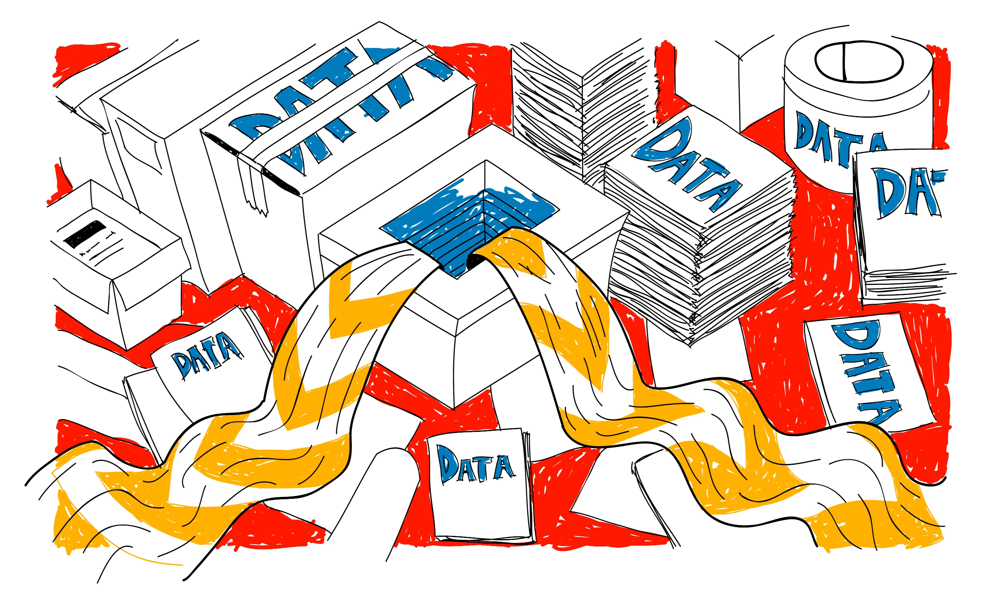
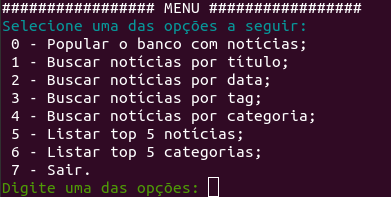
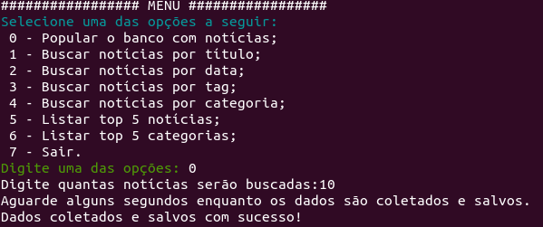
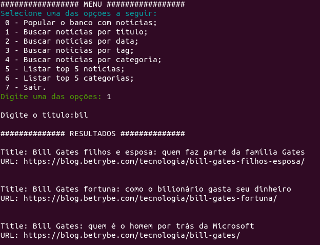
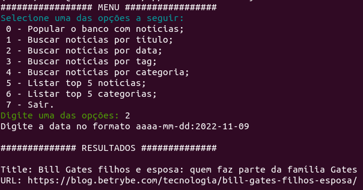
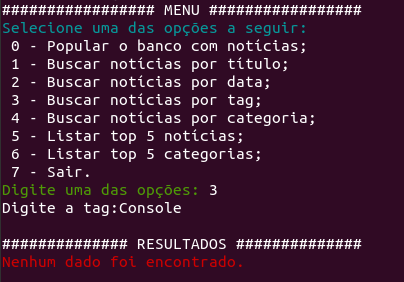
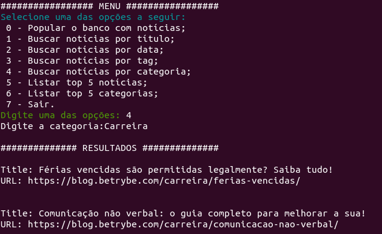
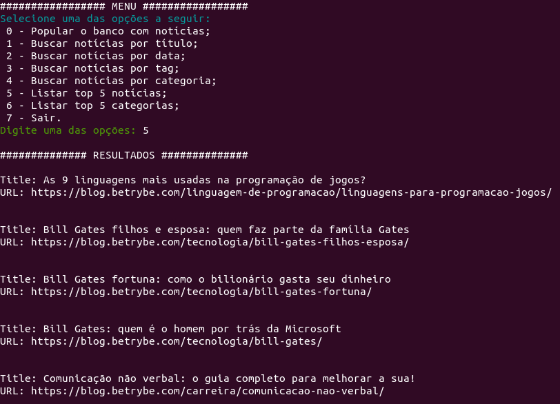
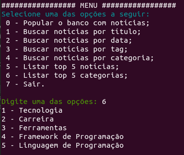
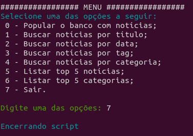

# Sobre

## Seção: `Raspagem de dados`

- Abordagem de coleta de dados pela web, apresentando ferramentas conhecidas como, [Requests](https://requests.readthedocs.io/en/latest/), [Parsel](https://parsel.readthedocs.io/en/latest/usage.html), [Selenium](https://www.selenium.dev/), [BeautifulSoup](https://www.crummy.com/software/BeautifulSoup/) e uso do [pymongo](https://pymongo.readthedocs.io/en/stable/) para salvar as informações coletadas em um mango de dados mongodb.

#

  <a href="./screenshots/jobs_list.png">
    </img>
  </a>

>Coleta de dados pela internet
## Projeto: `Tech News`

- Desenvolvido metodos, para requisitar e coletar dados do [blog da trybe](https://blog.betrybe.com/) e salvar no banco mongodb.

  

    <strong>
      :telescope: Usando menu interativo CLI:
    </strong>
  

⚠️ Siga os passos do docker para ver e interagir por cada opção do menu mostrada abaixo:

## Menu Inicial

Para ter acesso ao menu inicial, dentro do container com seu ambiente virtual iniciado digite o comando `tech-news-analyzer`

## Popular o banco com notícias

Primeira opção, realiza a coleta de dados do blog da trybe, você pode determinar quantas noticias deseja coletar do blog, após a coleta é realizada o armazenamento ao banco de dados que está no container.
Após realizar a coleta ao blog, é possivel procurar por titulos, data, tag e categorias, conforme a seguir.

## Buscar notícias por título

 que foram salvos no banco, digitando uma palavra ou letra de referencia, ele deve apresentar todos titulos compativeis com a busca

## Buscar notícias por data

Para buscar por uma nótica por data, deve-se respeitar o formato solicitado.

## Buscar notícias por tag

Nem toda notícia possui uma tag, mas é possivel procurar por uma tag especifica.
## Buscar notícias por categoria

Toda notícia possui uma categoria, é possivel procurar por uma especifica.
## Listar top 5 notícias

Consultando o armazenamento ao banco é possível listar as 5 nóticas mais populares com base em sua quantidade de comentários.

## Lista top 5 categorias

Assim como as notícias mais comentadas é possivel listar as 5 categorias mais abordadas.

## Sair

Ultima opção para sair, só é possivel sair do menu por essa opção ou por um fechamento forçado.

#

# Tecnologias e ferramentas usadas 🛠

# Desafios

- Maior desafio foi de lidar com "subtags" quando coletando algum tag especifico, se ele possuia uma tag dentro dele, como um negrito ou itálico, usando o parsel, usando o filtro para coleta somente do texto, ele acaba que ignora alguns elementos, depois de muita pesquisa, e tentativa de entender como usar melhor os seletores css, para coleta, foi possivel coletar o primeiro paragrafo de cada noticia juntamente com suas tags filhas.

# Conclusão

- Muito gratificante a conclusão de mais um projeto onde aprendi muito com apenas 11 requisitos.

# Iniciando o Projeto Tech News.

Importante: seguir a ordem apresentada a baixo, para o funcionamento.

  

    <strong>
      ⚠️ Configurações mínimas para execução do projeto
    </strong>
  

   - Sistema Operacional Distribuição Unix
 - Python versão >= 3.8.10 

  

    <strong>
      ⚠️ Inicie o docker-compose
    </strong>
  

Para ver a aplicação funcionando basta iniciar o docker compose, basta esta na pasta do repositório tendo o requisitos conforme informado na aba de requisitos, e iniciar o docker com `docker-compose up -d`

Após levantar o container para interagir com os comandos de linha, é necessário acessar o container usando o comando a seguir, `docker exec -it tech_news bash`, dentro do terminal do container é necessário entrar no ambiente virtual do python com o comando, `source .venv/bin/activate`, após esse comando o inicio do terminal deve aparecer com `(.venv)` antes do root, deve-se usar o comando `pip install .` para instalar o menu, após isso basta usar o comando apresentado na parte de amostra.

  

    <strong>
      :newspaper_roll: Requisitos solicitados durante o desenvolvimento do projeto
    </strong>
  

 
### Resultado por requisito
*Nome* | *Avaliação*
--- | :---:
1 - Crie a função fetch | :heavy_check_mark:
2 - Crie a função scrape_novidades | :heavy_check_mark:
3 - Crie a função scrape_next_page_link | :heavy_check_mark:
4 - Crie a função scrape_noticia | :heavy_check_mark:
5 - Crie a função get_tech_news para obter as notícias! | :heavy_check_mark:
6 - Crie a função search_by_title | :heavy_check_mark:
7 - crie a função search_by_date | :heavy_check_mark:
8 - Crie a função search_by_tag | :heavy_check_mark:
9 - Crie a função search_by_category | :heavy_check_mark:
10 - Crie a função top_5_news | :heavy_check_mark:
11 - Crie a função top_5_categories | :heavy_check_mark:
12 - Crie a função analyzer_menu | :heavy_check_mark:
13 - Implemente as funcionalidades do menu | :heavy_check_mark:

#

  

